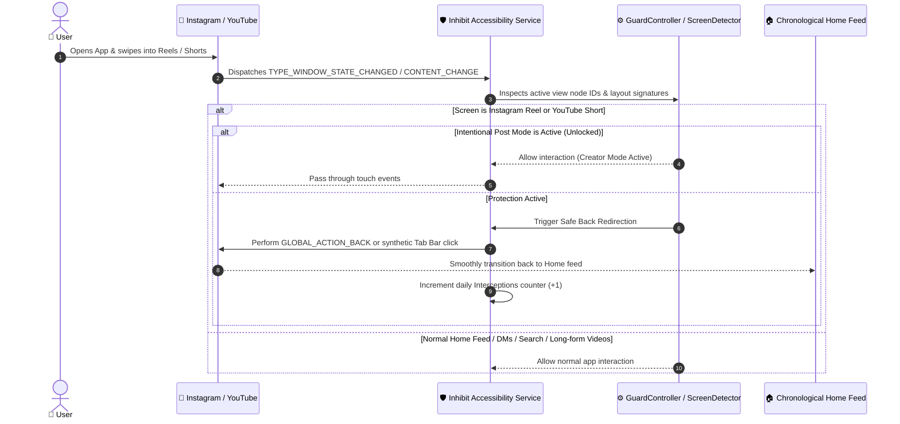
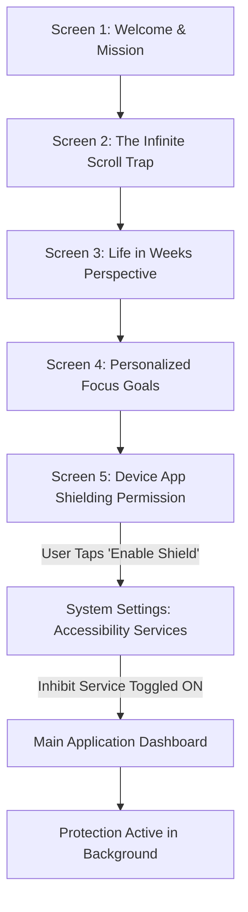
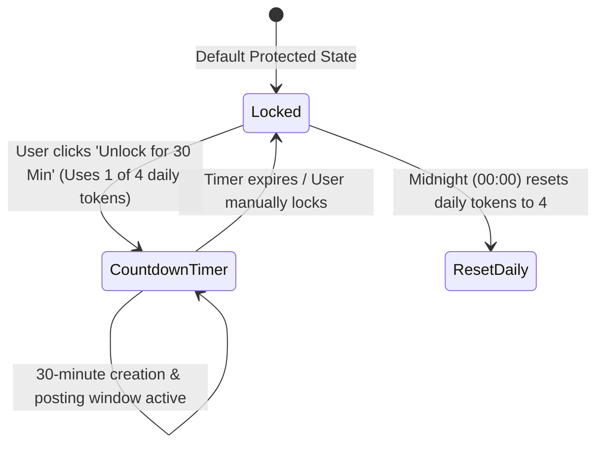

<div align="center">

# 🛑 Inhibit (NoScroll)
### *Scroll Less. Live More.*

[](https://github.com/pavanstarkin-tech/inhibit/releases/tag/v1.0.0)
[](https://github.com/pavanstarkin-tech/inhibit/releases/download/v1.0.0/inhibit-v1.0.0.apk)
[](https://pavanstarkin-tech.github.io/inhibit/)
[](https://pavanstarkin-tech.github.io/inhibit/#privacy)

<p align="center">
  <b>The first privacy-engineered Android distraction interceptor designed to stop short-form algorithmic loops (Instagram Reels & YouTube Shorts) and redirect you back to your chronological feed — <i>without closing your apps</i>.</b>
</p>

[✨ Try Live Web Simulator](https://pavanstarkin-tech.github.io/inhibit/#simulator) • [📥 Download APK](https://github.com/pavanstarkin-tech/inhibit/releases/download/v1.0.0/inhibit-v1.0.0.apk) • [🛡️ Protected Services](#-protected-services-matrix) • [🏗️ Architecture & Flows](#-interactive-system-flows) • [⚡ Quickstart](#-developer-quickstart)

---

</div>

## 🌟 Key Highlights & Philosophy

<table>
<tr>
<td width="33%" align="center">
<h3>🚪 No App Exits</h3>
<p>Unlike blunt blockers that crash or force-close your apps, Inhibit gracefully navigates back to your Home feed so DMs, search, and posts remain 100% usable.</p>
</td>
<td width="33%" align="center">
<h3>⏱️ Intentional Post Mode</h3>
<p>Creators get <b>4 daily 30-minute unlock sessions</b> to upload stories, post content, and respond to community messages distraction-free.</p>
</td>
<td width="33%" align="center">
<h3>🔒 100% Local Sandboxed</h3>
<p>Zero cloud servers. Zero analytics. Zero telemetry. Detection heuristics run purely on-device via Android Accessibility Callbacks.</p>
</td>
</tr>
</table>

---

## 🗺️ Interactive System Flows

<details open>
<summary><b>1. 🔄 Zero-Exit Interception Flow (How Reels & Shorts are Deflected)</b> <i>[Click to expand/collapse]</i></summary>


</details>

<details>
<summary><b>2. 🚀 Onboarding & Setup Workflow</b> <i>[Click to expand/collapse]</i></summary>



#### Onboarding Step Breakdown:
1. **Welcome**: Introduction to Inhibit's neo-brutalist focus ecosystem.
2. **The Problem**: Exposing how infinite swipe containers hijack dopamine pathways.
3. **Perspective**: Life-in-Weeks visualization quantifying reclaimed time.
4. **Customization**: Choosing protected platforms and daily intent targets.
5. **System Bridge**: Guiding Android Accessibility permission directly before entering the home feed.
</details>

<details>
<summary><b>3. ⚡ Intentional Post Mode Flow</b> <i>[Click to expand/collapse]</i></summary>


</details>

---

## 🛡️ Protected Services Matrix

| Service | Supported Surfaces | Redirection Strategy | Status |
|---|---|---|---|
| **Instagram** | `Instagram Reels`, `Explore Grid` | In-app Back Navigation to Home Feed | **ACTIVE** ✅ |
| **YouTube** | `YouTube Shorts Viewer` | Redirection to Subscriptions / Home Video List | **ACTIVE** ✅ |
| **TikTok** | `For You Page (FYP)` | Surface probe in calibration | *Coming Soon* ⏳ |
| **Facebook** | `Facebook Reels & Watch Loops` | Surface probe in calibration | *Coming Soon* ⏳ |
| **X (Twitter)** | `Immersive Video Swipe Player` | Surface probe in calibration | *Coming Soon* ⏳ |
| **Reddit** | `Vertical Video Feed` | Surface probe in calibration | *Coming Soon* ⏳ |

---

## 📱 Interactive Feature Tour

<details>
<summary><b>🏠 1. Home Dashboard & Analytics</b></summary>

- **Neo-Brutalist Stat Cards**: Displays real-time intercepted reels count, daily saved hours, and active service statuses.
- **Service Configuration Sheets**: Tap Instagram or YouTube cards to fine-tune granular rules (toggle Reels separately from Explore).
- **One-Tap Testing**: Built-in simulator buttons to verify deflection logic on-demand.
</details>

<details>
<summary><b>🛡️ 2. Shield & Post Mode Hub</b></summary>

- **Granular Toggles**: Enable/disable protection per app without disabling the main accessibility service.
- **Creator Unlock Tokens**: 4 daily sessions with remaining token counters and visual countdown badges.
- **Rule Bundle Manager**: Hot-reloadable local rule signatures.
</details>

<details>
<summary><b>👤 3. Profile & Life in Weeks Reclaimer</b></summary>

- **Life in Weeks Visualization**: Interactive age grid showing spent weeks vs. reclaimed future years.
- **Compounding ROI**: Translates 2.5 hours of daily doomscroll deflection into **9.9+ lifetime years gained**.
- **Zero-Data Proof**: Sandboxed local state confirmation.
</details>

---

## 📦 Download & Installation

### Option 1: Direct APK Download (Recommended)
1. Download the latest compiled package: [**`inhibit-v1.0.0.apk`**](https://github.com/pavanstarkin-tech/inhibit/releases/download/v1.0.0/inhibit-v1.0.0.apk)
2. On your Android device (Android 8.0+ / API 26+), tap the APK to install.
3. If prompted, allow **"Install from unknown sources"**.
4. Open Inhibit, complete the onboarding, and toggle **Inhibit Shield** in **Accessibility Settings**.

### Option 2: Build from Source
```bash
# 1. Clone repository
git clone https://github.com/pavanstarkin-tech/inhibit.git
cd inhibit

# 2. Switch to source branch
git checkout source

# 3. Navigate to Flutter app
cd flutter_app

# 4. Fetch dependencies
flutter pub get

# 5. Build Debug or Release APK
flutter build apk --debug
# Output: flutter_app/build/app/outputs/flutter-apk/app-debug.apk
```

---

## 🛠️ Architecture & Tech Stack

```
inhibit/
├── flutter_app/                      # Cross-Platform Flutter Mobile Application
│   ├── android/                      # Native Android & Kotlin Engine
│   │   └── app/src/main/kotlin/.../
│   │       ├── shield/
│   │       │   ├── ReelsBlockAccessibilityService.kt   # System event listener & action dispatcher
│   │       │   ├── ScreenDetector.kt                   # UI hierarchy & container heuristic analyzer
│   │       │   ├── GuardController.kt                  # State machine & intentional post mode coordinator
│   │       │   └── Screen.kt                           # Supported screen definitions & rules
│   ├── lib/                          # Dart / Flutter UI layer
│   │   ├── ui/                       # Neo-Brutalist screens (Home, Shield, Profile, Onboarding)
│   │   ├── core/                     # AppState, NativeShieldService (MethodChannel)
│   └── pubspec.yaml
│
└── website/                          # Neo-Brutalist React + Vite Showcase Web App
    ├── src/                          # Interactive Phone Simulator & Reclaim Calculator
    ├── index.html
    └── package.json
```

- **Frontend App**: Flutter & Dart (Neo-brutalist theme, high-contrast borders, bold typography)
- **Native Android Core**: Kotlin (`AccessibilityService`, `AccessibilityNodeInfo`, `MethodChannel`)
- **Showcase Web**: React 19, Vite, Lucide Icons, Canvas Confetti, GitHub Pages

---

## 🔒 Privacy Guarantee

Inhibit operates on a strict **Zero-Telemetry Policy**:
- ❌ **No Internet Connection Required**: The Android app has 0 network dependencies for its core shield.
- ❌ **No Keylogging or Screen Capture**: The accessibility service only inspects container resource IDs to detect Reels/Shorts viewers.
- ❌ **No User Tracking or Accounts**: All statistics (hours saved, reels intercepted) are stored locally using on-device preferences.

---

<div align="center">
  <sub>Crafted with 🖤 for digital wellness & intentional living.</sub><br>
  <sub>Licensed under MIT • © Inhibit Project</sub>
</div>
